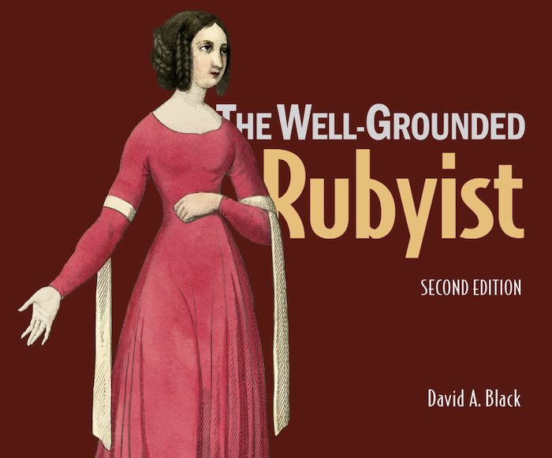

# twg_rubyist

## GitHub repository: https://github.com/r-craig73/twg_rubyist

#### By Ron Craig (https://github.com/r-craig73 * ron.craig@comcast.net)

## Description
### Personal project: Store and run ruby scripts in the _The Well-Groomed Rubyist_ 2nd edition, by David A. Black.

<kbd></kbd>

### Will organize each folder by chapter.

| Chapter | Title                 |
| :---:   |     :---              |
| ch01 | Bootstrapping your Ruby literacy |
| ch02 | Built-in Class and Modules |

## Technologies Used
* Ruby 2.3.4

## Support and contact details
_Please contact ron.craig@comcast.net with any questions._

### MIT License